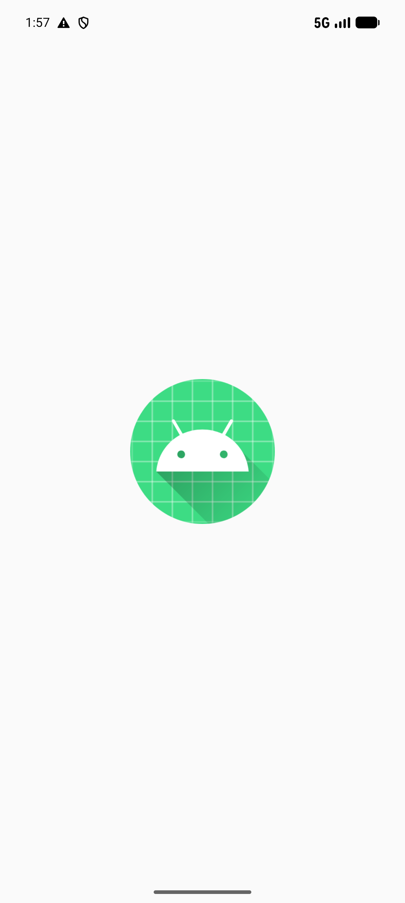
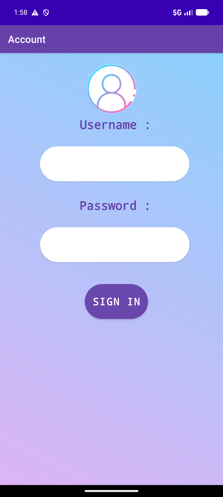
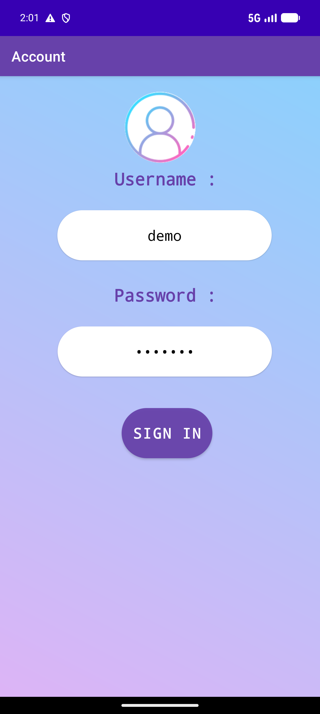
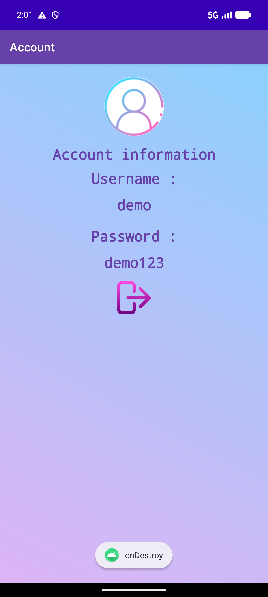
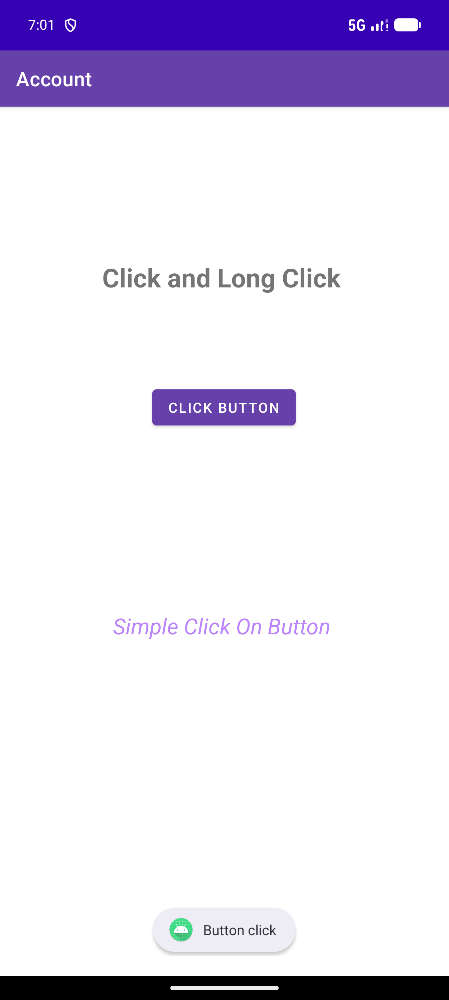

# Séance 2 - Jetpack Compose & Kotlin Multiplateforme

Ce dossier regroupe les travaux pratiques de la séance 2 du module **Développement Mobile** (ENSET), portant sur les activités Android (cycle de vie, gestion des événements, navigation entre activités) et une introduction à Jetpack Compose.

Support de cours : [`Dév_Mobile_Natif_Partie2.pdf`](./Dév_Mobile_Natif_Partie2.pdf)

## Projets

### 1. Calculator2

Calculatrice Android illustrant :
- La gestion des événements (`onClick`) sur les boutons numériques et opérateurs.
- Deux interfaces différentes selon l'orientation de l'écran : `PortraitActivity` (calculatrice simple) et `LandscapeActivity` (calculatrice scientifique), avec gestion des changements de configuration (`orientation|screenSize`).

| Portrait (vide) | Portrait (calcul) |
|---|---|
|  |  |

| Paysage (vide) | Paysage (calcul) |
|---|---|
|  |  |

Une activité supplémentaire `ClickLongClickActivity` (non exportée, lancée en interne) reprend l'exercice **Activité n°1 — Click et LongClick** du support de cours :

| Clic simple | Clic long |
|---|---|
|  |  |

### 2. SplaschScreen-NavigationEntreEcrans-Internationalisation

Application illustrant :
- Un écran de démarrage (`SplashActivity`) qui redirige automatiquement après un délai.
- La navigation entre activités via `Intent` (`FirstActivity` → `SecondActivity`).
- Le passage de données entre activités avec `Bundle` (username/password saisis dans le formulaire de connexion).
- L'internationalisation de l'application (arabe / français).

| Splash | Écran de connexion | Connexion remplie | Écran d'arrivée |
|---|---|---|---|
|  |  |  |  |

Une activité supplémentaire `ClickLongClickActivity` (non exportée) reprend également l'exercice **Click et LongClick** :

| Clic simple | Clic long |
|---|---|
|  |  |

## Build & exécution

Chaque projet est un module Gradle Android indépendant (son propre `gradlew`) :

```bash
cd Calculator2
./gradlew assembleDebug

cd "../SplaschScreen-NavigationEntreEcrans-Internationalisation-master"
./gradlew assembleDebug
```

> Note : le projet `SplaschScreen...` utilise AGP 7.4.2, incompatible avec les JDK récents (17+) pour l'étape de dexing (D8). Compiler avec un JDK 17 :
> ```bash
> ./gradlew -Dorg.gradle.java.home="<chemin_jdk17>" assembleDebug
> ```
