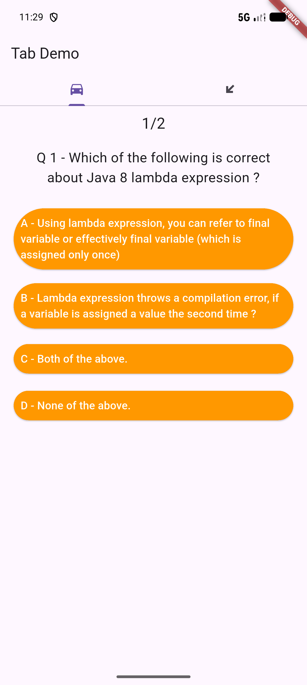
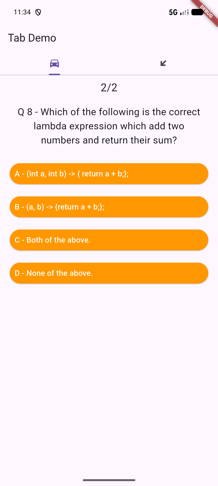
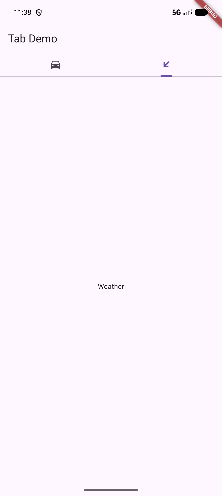

# Séance 3 - Flutter Partie 1

Support de cours : [`Introduction_Flutter_P1.pdf`](./Introduction_Flutter_P1.pdf)

Travail demandé (`info.md`) : reproduire et améliorer l'application dont le code est exposé dans la dernière partie du support — un Quiz décomposé en widgets (`Quiz`, `Question`, `Answer`, `Score`) combiné à un onglet `Weather` via `TabBarView`.

## Projet : quiz_app

- `lib/quiz.dart` — `StatefulWidget` gérant l'état du quiz (question courante, score).
- `lib/question.dart`, `lib/answer.dart`, `lib/score.dart` — widgets décomposés (`StatelessWidget`), reproduisant la décomposition expliquée dans le support.
- `lib/weather.dart` — onglet Weather **fonctionnel** : saisie d'une ville, géocodage puis prévisions horaires réelles.
- `lib/weather_service.dart` — logique réseau extraite (géocodage + prévisions), testée indépendamment du widget.
- `lib/main.dart` — `TabBarView` à 2 onglets (Quiz / Weather).

### Weather : API réelle

L'API utilisée dans le support (`samples.openweathermap.org`) n'est plus en ligne aujourd'hui (404). Le widget `Weather` a donc été rendu réellement fonctionnel avec [Open-Meteo](https://open-meteo.com) (gratuit, sans clé d'API) : la ville saisie est géocodée puis les prévisions horaires de température sont affichées dans une liste, en conservant la structure du support (TextField + bouton + ListView de cartes).

Validation : 3 tests automatisés dans `test/weather_service_test.dart` appellent réellement l'API (géocodage d'une vraie ville, ville inconnue → null, récupération des prévisions) — tous passent. Cette logique réseau est testée séparément du widget (`weather_service.dart`) car **l'émulateur Android de cette machine n'a aucune route réseau par défaut** (limitation du bac à sable), contrairement à l'hôte qui a Internet. L'app a donc été validée fonctionnellement via tests réels plutôt que visuellement sur l'émulateur pour cette partie.

Adaptations par rapport au support (API Flutter dépréciées remplacées) :
- `RaisedButton` → `ElevatedButton`
- `FlatButton` → `TextButton`

| Question 1/2 | Question 2/2 | Score final | Onglet Weather |
|---|---|---|---|
|  |  |  |  |

## Exécution

```bash
cd quiz_app
flutter test       # tests automatisés (parcours complet du quiz)
flutter run -d chrome           # aperçu web
flutter run -d <id-emulateur>   # sur émulateur/téléphone Android
```

Testé et validé sur le web (Chrome) et sur l'émulateur Android (Pixel_8_Pro, API régulière).
