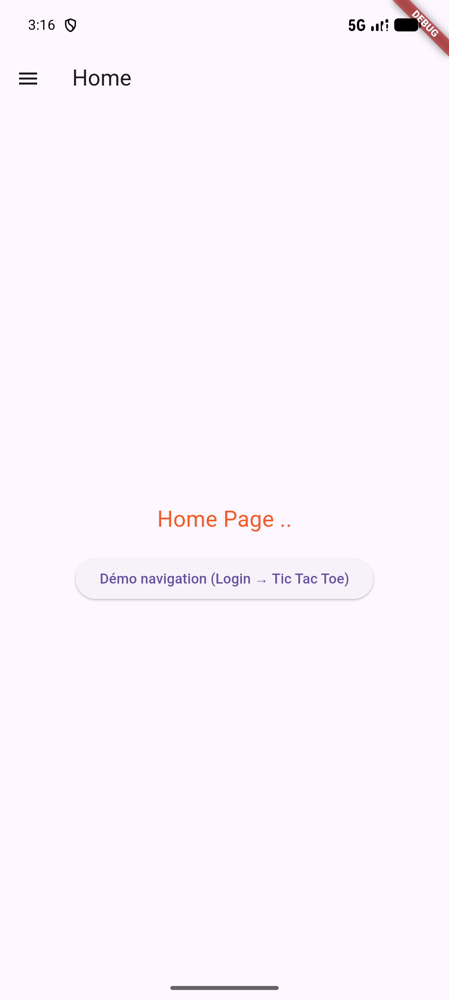
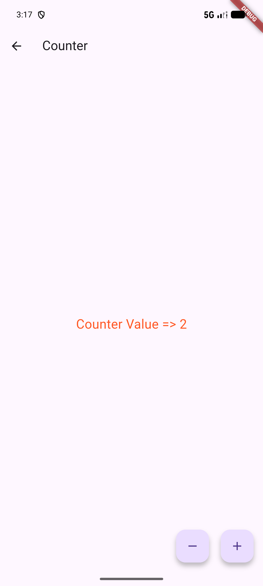
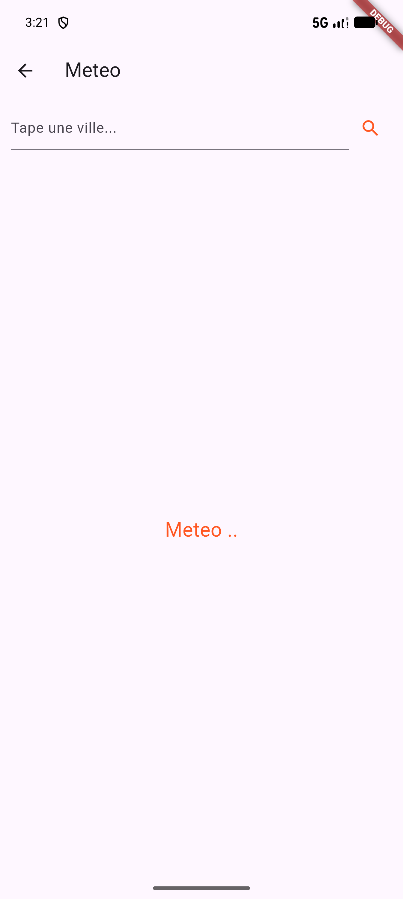
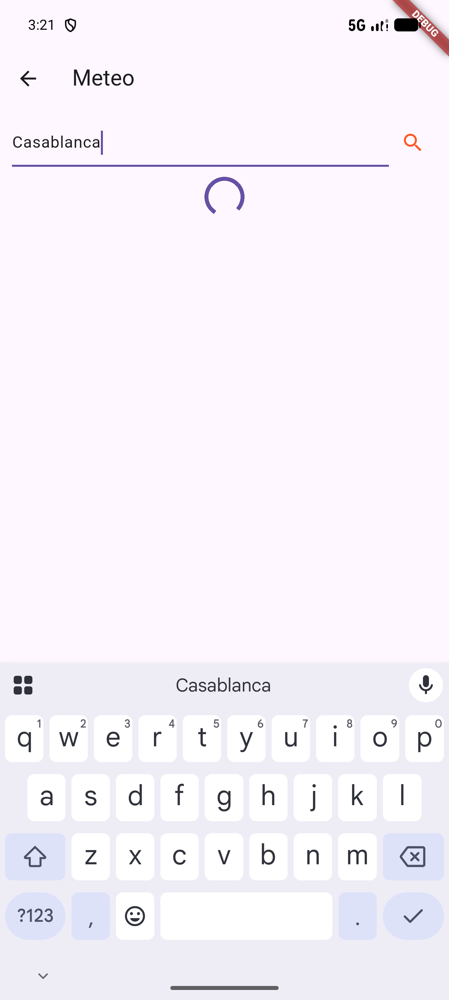

# Séance 4 — Flutter Partie 2

Support de cours : [`Intro_Flutter_P2.pdf`](./Intro_Flutter_P2.pdf)

Deux axes couverts par cette séance :

1. **Programmation orientée objet avec Dart** — classes, constructeurs, héritage, polymorphisme, gestion des erreurs, modèle géométrique complet.
2. **Application de synthèse Flutter** — navigation par `Drawer`, routes nommées, `StatefulWidget` / `setState`, navigation impérative (`push` / `pop`) avec passage de données, consommation d'API REST.

---

## Projet : app_synthese

### Structure

```
lib/
├── main.dart                      # MaterialApp + routes nommées
├── global/
│   └── global_parameters.dart     # Table de routes + menus du Drawer
├── models/
│   ├── personne.dart              # Exemple 1 info.md — héritage Personne/Salarie
│   ├── point.dart                 # Exemple 2 info.md + PDF — constructeurs, opérateur +
│   ├── rectangle.dart             # Exemple 3 info.md (RectangleSimple) + PDF (Shape)
│   ├── shape.dart                 # Classe abstraite Shape (PDF)
│   ├── circle.dart                # Circle extends Shape (PDF)
│   ├── geometric_design.dart      # Agrégat de Shape, sérialisable JSON (PDF)
│   ├── contact.dart               # Modèle Contact
│   └── tic_tac_toe.dart           # Logique du morpion (navigation avec données)
├── pages/
│   ├── home_page.dart             # Page d'accueil
│   ├── counter_page.dart          # StatefulWidget + setState (PDF p.64)
│   ├── contacts_page.dart         # Liste de contacts + ajout (à vous de coder)
│   ├── meteo_page.dart            # Météo Open-Meteo (à vous de coder)
│   ├── gallery_page.dart          # Grille d'images (à vous de coder)
│   ├── login_page.dart            # Écran 1 démo navigation (PDF p.55)
│   └── tic_tac_toe_page.dart      # Écran 2 — reçoit le nom du joueur
├── services/
│   └── weather_service.dart       # Géocodage + prévisions Open-Meteo
└── widgets/
    ├── my_drawer.dart             # Drawer avec ListView.separated
    ├── drawer_header_widget.dart  # En-tête du Drawer (gradient + logo)
    └── drawer_item_widget.dart    # Élément du menu (ListTile + navigation)
```

---

## POO Dart (info.md + PDF)

### Exemple 1 — Héritage et polymorphisme (`personne.dart`)

```dart
class Personne { String nom; int age; ... }
class Salarie extends Personne { double salaire; void augmentation(double m); }
```

### Exemple 2 — Point (`point.dart`)

Fusion `info.md` + `point.model.dart` du PDF :

| Élément | Source |
|---|---|
| `const Point(this.x, this.y)` | `info.md` — constructeur positionnel |
| `const Point.origin()` | `info.md` — constructeur nommé |
| `void affiche()` | `info.md` — print `[x,y]` |
| `Point operator +(Point p)` | `info.md` — surcharge opérateur |
| `factory Point.from(List<double>)` | PDF |
| `Point.fromJson / toJson` | PDF — sérialisation |
| `double distanceTo(Point p)` | PDF — utilisé par `Circle` |

### Exemple 3 — Rectangle (`rectangle.dart`)

- `RectangleSimple` — version simple de `info.md` (`surface()`, `perimetre()`)
- `Rectangle extends Shape` — version PDF (basée sur deux `Point`)

### Modèle géométrique complet (PDF)

```
Shape (abstract)
├── Circle   → getRadius(), getArea(), getPerimeter(), toJson()
└── Rectangle → getWidth(), getHeight(), getArea(), getPerimeter(), toJson()
GeometricDesign → List<Shape>, toJsonString()
```

---

## Pages de l'application

| Page | Route | Fonctionnalité |
|---|---|---|
| **Home** | `/` | Page d'accueil + bouton démo navigation |
| **Counter** | `/counter` | `StatefulWidget` — compteur +/− |
| **Contacts** | `/contacts` | Liste + ajout de contacts en mémoire |
| **Meteo** | `/meteo` | Météo horaire réelle (Open-Meteo) |
| **Gallery** | `/gallery` | Grille `GridView` |
| **Login → Tic Tac Toe** | `/login` | Démo `Navigator.push` avec passage de données |

### Météo : API réelle

L'URL de démo du support n'est plus accessible. La page `Meteo` utilise [Open-Meteo](https://open-meteo.com) (gratuit, sans clé) : géocodage de la ville saisie puis liste des prévisions horaires de température, en conservant la structure du support.

---

## Adaptations par rapport au support

| Sujet | PDF | Implémentation |
|---|---|---|
| `textTheme.bodyText2` | Utilisé dans `main.dart` | Supprimé (API dépréciée Flutter 3) |
| `DrawerHeader` logo | `AssetImage("images/logo.png")` | `Icon(Icons.school)` (asset absent du projet) |
| Constructeur `Point` | `Point({required this.x, required this.y})` | `Point(this.x, this.y)` (positionnel, info.md) |

---

## Captures d'écran

| Home | Drawer | Counter | Contacts |
|---|---|---|---|
|  |  |  |  |

| Ajout contact | Meteo (vide) | Meteo (résultat) |
|---|---|---|
|  |  |  |

---

## Tests

```
test/
├── oop_test.dart           # 10 tests — Personne, Point, Circle, Rectangle, GeometricDesign
├── tic_tac_toe_test.dart   # 3 tests — logique du morpion
├── weather_service_test.dart # 2 tests — appels API réels (géocodage + prévisions)
└── widget_test.dart        # 3 tests widget — Counter, Contacts, navigation Login→TicTacToe
```

**18 tests, tous verts.**

## Exécution

```bash
cd app_synthese
flutter test                          # suite complète
flutter run -d emulator-5554          # émulateur Android
flutter run -d chrome                 # navigateur
```
